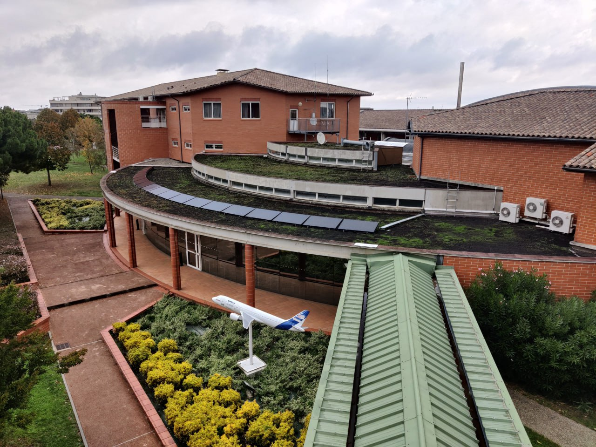
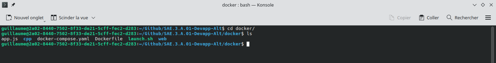
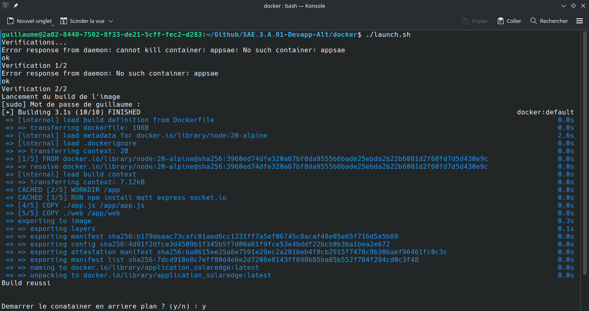
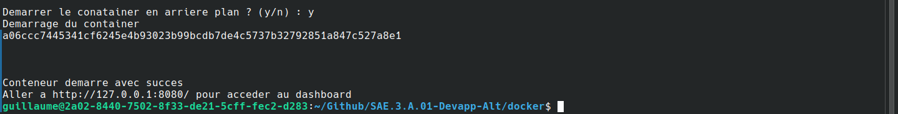
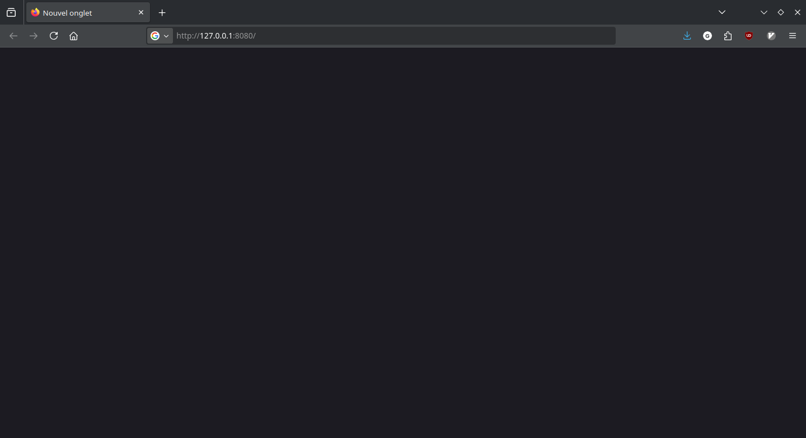
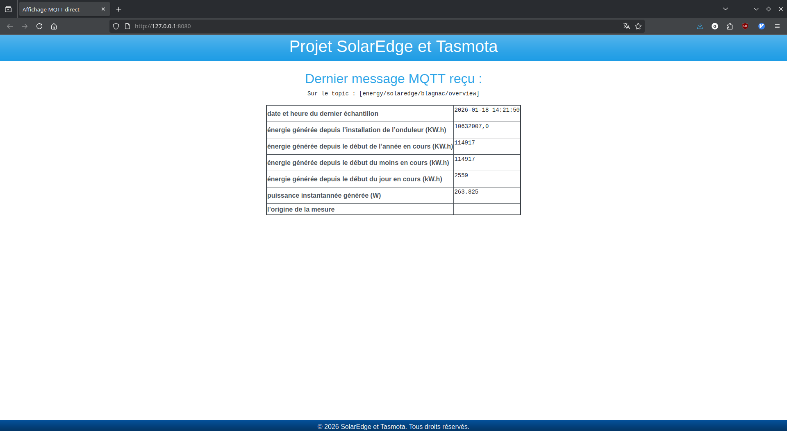

= Documentation Utilisateur
:toc: 

== SAE 3.01 DevAPP
Ce document est un guide destiné à l'utilisateur final pour lui indiquer les prcédures pour faire fonctionner le projet.

{empty} +
{empty} +
{empty} +

Pour: RB et EP + 
Du groupe 3A :  RATSIMBA Jeremy, DUPONT Alexis et LARROUTIS Guillaume

== Présentation du projet

L'objectif du projet est de développer une interface web permettant de visualiser les données remontées par les capteurs en direct afin de voir, en temps réel, la production d'électricité etc...
Il doit aussi être possible d'être notifié via les différents systèmes lorsque les capteurs voient un dépassement des seuils de consommation énergétique. 
Le but est donc de prévenir ce cas dans les salles afin que les personnes présentes agissent pour calmer la situation.  

== L'environnement

Pour faire tourner l'application, il est nécessaire d'avoir Docker.

== Lancer l'application

Pour pouvoir lancer l'application il faut se rendre dans le même répertoire que le script `launch.sh` et l'exécuter en lançant la commande 
[source, bash]
---
./launch.sh
---

Exemple : 

En vous plaçant dans le bon répertoire : 

Vous pouvez lancer l'application (si cela ne fonctionne pas, essayez l'aide en bas de page) : 

Le lanceur vous demande si vous souhaitez lancer l'application en background ou en forefround (des logs s'afficheront dans le terminal lors du background), saisissez 'y' ou 'n' : 

Une fois lancée : rendez-vous à l'adresse http://127.0.0.1:8080/

Les données ne devraient plus tarder à arriver.

Si cela ne fonctionne pas du premier coup. Essayer de lui ajouter les droits d'exécutions, puis de le ré-exécuter : 
[source, bash]
--- 
chmod u+x launch.sh
./launch.sh
---

== Accéder à l'interface web

Pour accéder à l'interface web, allez sur votre navigateur et allez à l'adresse : http://127.0.0.1:8080/
